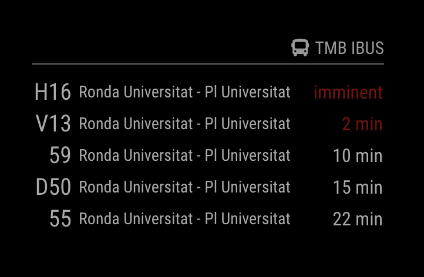

# MMM-TMB

<!-- badges: start -->

[](https://github.com/jaumebosch/MMM-TMB/actions/workflows/ci.yml)
[](https://www.tidyverse.org/lifecycle/#stable)
[](https://opensource.org/licenses/MIT)
[](http://makeapullrequest.com)
[](https://twitter.com/jaumebosch)

<!-- badges: end -->

A [MagicMirror²](https://github.com/MagicMirrorOrg/MagicMirror) module that displays live bus
arrival times for Barcelona, using the official [TMB](https://www.tmb.cat/en/home) iBus API.



- Several stops and lines in a single module, merged into one list sorted by arrival time
- Colour and blink warnings as a bus gets closer
- Countdowns keep ticking locally between API refreshes
- Available in English, Catalan and Spanish
- No runtime dependencies, and a stop that fails never takes the rest of the display down
- Retries with back-off, honours the API's `Retry-After`, and stops on rejected credentials instead
  of hammering the endpoint

## Requirements

- MagicMirror² 2.15.0 or newer
- Node.js 18 or newer
- A free TMB API `appId` / `appKey` pair, requested at [developer.tmb.cat](https://developer.tmb.cat/)

## Installation

From your MagicMirror `modules` folder:

```bash
git clone https://github.com/jaumebosch/MMM-TMB.git
cd MMM-TMB
npm install --omit=dev
```

`npm install --omit=dev` installs nothing at all — the module has no runtime dependencies.
Drop the flag if you intend to work on the module itself.

## Usage

Add the module to the `modules` array in `config/config.js`:

```js
{
    module: "MMM-TMB",
    position: "bottom_right",
    config: {
        appId: "YOUR_APP_ID",
        appKey: "YOUR_APP_KEY",
        busStops: [
            { busStopCode: "001124", busLine: "H12" },
            { busStopCode: "002266" }
        ]
    }
}
```

The header reads "TMB iBus" with a bus icon. To change the wording, set MagicMirror's standard
`header` property alongside `module` and `position` — the icon stays, unless you turn it off with
`showHeaderIcon`. Note that MagicMirror upper-cases header text.

## Configuration options

| Option            | Type      | Default | Description                                                                                        |
| ----------------- | --------- | ------- | -------------------------------------------------------------------------------------------------- |
| `appId`           | `string`  | —       | **Required.** TMB API application id.                                                              |
| `appKey`          | `string`  | —       | **Required.** TMB API application key.                                                             |
| `busStops`        | `array`   | —       | **Required.** Stops to monitor, 1 to 25 entries. See [busStops](#busstops) below.                  |
| `maxEntries`      | `int`     | `5`     | Maximum number of rows shown, across all stops. `1`–`50`.                                          |
| `refreshInterval` | `int`     | `60000` | Milliseconds between API refreshes. `10000`–`3600000`.                                             |
| `retryDelay`      | `int`     | `5000`  | Milliseconds before the first retry after a failure; doubles per failure, capped at the interval.  |
| `requestTimeout`  | `int`     | `10000` | Milliseconds before an API request is aborted. `1000`–`60000`.                                     |
| `warningTime`     | `int`     | `600`   | Seconds under which an arrival is coloured. `0`–`86400`.                                           |
| `blinkingTime`    | `int`     | `300`   | Seconds under which an arrival blinks. Must be ≤ `warningTime`.                                    |
| `imminentTime`    | `int`     | `60`    | Seconds under which "imminent" replaces the countdown. Must be ≤ `blinkingTime`.                   |
| `showStopName`    | `boolean` | `true`  | Show the stop name column. Useful to turn off when monitoring a single stop.                       |
| `showDestination` | `boolean` | `false` | Show the destination reported by the API. Not every stop reports one; the cell is left empty then. |
| `showHeaderIcon`  | `boolean` | `true`  | Show the bus icon next to the header title.                                                        |
| `animationSpeed`  | `int`     | `500`   | Milliseconds of the fade used when the display updates.                                            |

Out-of-range numbers are clamped to the limits above and reported in the MagicMirror log,
so a typo degrades the display instead of breaking it. Missing or malformed required options are
shown directly on the mirror.

### busStops

```js
busStops: [
  { busStopCode: "001124", busLine: "H12" }, // only line H12 at this stop
  { busStopCode: "002266" }, // every line at this stop
  "001124" // shorthand, equivalent to the second form
];
```

| Option        | Type     | Description                                                                                                                                                                   |
| ------------- | -------- | ----------------------------------------------------------------------------------------------------------------------------------------------------------------------------- |
| `busStopCode` | `string` | **Required.** The stop code printed at the bus stop, leading zeroes and all. You can also look it up at [AMB](https://www.ambmobilitat.cat/principales/BusquedaParadas.aspx). |
| `busLine`     | `string` | _Optional._ Restrict this stop to a single line. Omit it to show every line serving the stop.                                                                                 |

## Styling

Every element carries a `MMM-TMB-*` class, and the colours are CSS custom properties, so you can
override them from `css/custom.css` without touching the module:

```css
.MMM-TMB {
  --mmm-tmb-warning-color: #ebcb8b;
  --mmm-tmb-imminent-color: #bf616a;
  --mmm-tmb-stop-max-width: 140px;
}
```

| Class                  | Applied to                                     |
| ---------------------- | ---------------------------------------------- |
| `.MMM-TMB-line`        | Line number cell                               |
| `.MMM-TMB-stop`        | Stop name cell                                 |
| `.MMM-TMB-destination` | Destination cell, when `showDestination` is on |
| `.MMM-TMB-time`        | Countdown cell                                 |
| `.MMM-TMB-normal`      | Countdown above `warningTime`                  |
| `.MMM-TMB-warning`     | Countdown at or under `warningTime`            |
| `.MMM-TMB-blinking`    | Countdown at or under `blinkingTime`           |
| `.MMM-TMB-imminent`    | Countdown at or under `imminentTime`           |

Blinking is disabled automatically when the system asks for reduced motion.

## Troubleshooting

| What you see on the mirror              | What to do                                                                  |
| --------------------------------------- | --------------------------------------------------------------------------- |
| A message about `appId` / `appKey`      | The credentials are missing from the config block.                          |
| `Invalid bus stop code`                 | `busStopCode` must be digits only; keep the leading zeroes as printed.      |
| Nothing but "Loading bus times…"        | The helper never answered. Check the MagicMirror log for `[MMM-TMB]` lines. |
| "Bus times are temporarily unavailable" | The API rejected or dropped the request; the module retries with back-off.  |
| "TMB rejected the appId / appKey"       | The credentials are wrong. Polling stops: fix them and restart the mirror.  |
| "Bus times are out of date"             | No refresh for three intervals, so the countdowns are no longer trusted.    |
| "No buses at this moment"               | The API answered normally with no bus due (common at night).                |

API requests are made by the node helper, and the credentials never appear in a log line or an
error message. Note that MagicMirror serves `config/config.js` to the browser, so the credentials
are present there as in any other module — keep the mirror off the public network.

## Development

See [CONTRIBUTING.md](.github/CONTRIBUTING.md) for the layout and the checks.

```bash
npm install
npm run check   # lint + formatting + tests
```

To check your credentials, a stop code, or what a given stop actually reports, query the live API
once:

```bash
TMB_APP_ID=... TMB_APP_KEY=... npm run smoke -- 001124        # every line at the stop
TMB_APP_ID=... TMB_APP_KEY=... npm run smoke -- 001124 H12    # one line only
```

It prints the raw `ibus` entries, the fields they contain, and the snapshot the module would build
from them.

## Licence

MIT © [@jaumebosch](https://github.com/jaumebosch) — see [LICENSE](LICENSE).
